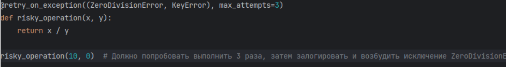

# intern_test_task
Тестовое задание

1. Написать декоратор
2. Парсинг телеграм бот.

Реализовано:
Задача 1. Из 2 сделан парсинг и сохранение данных.

-----
## 1. Декоратор.

Функциональные требования:
1. Декоратор принимает параметры: список исключений, при которых нужно повторить попытку, и максимальное количество 
попыток.
2. При каждой попытке, если возникает исключение из указанного списка, функция должна быть повторно вызвана после задержки в 1 секунду.
3. Если количество попыток исчерпано, исключение должно быть перехвачено и залогировано, после чего возбуждено снова.
4. Декоратор должен поддерживать функции с любым количеством аргументов.

Пример использования:

## 2. Создать Телеграм бота и парсер.

Сайт для парсинга: https://books.toscrape.com/
Пример ссылки пользователя: https://books.toscrape.com/catalogue/category/books/travel_2/index.html 

Функциональные требования:
1. Регистрация пользователя, он должен будет ввести имя, после /start(После регистрации ему открывается выбор категории)
2. Выбор категории (Человек вставляет ссылку категории товара которую хочет спарсить)
3. После выбора категории парсер начинает работать (А бот напишет, что бы вы ожидали)
4. По окончанию парсинга выдаёт csv c товарами в котором написаны(Название, цена, ссылка, есть ли в наличии и их характеристики)

